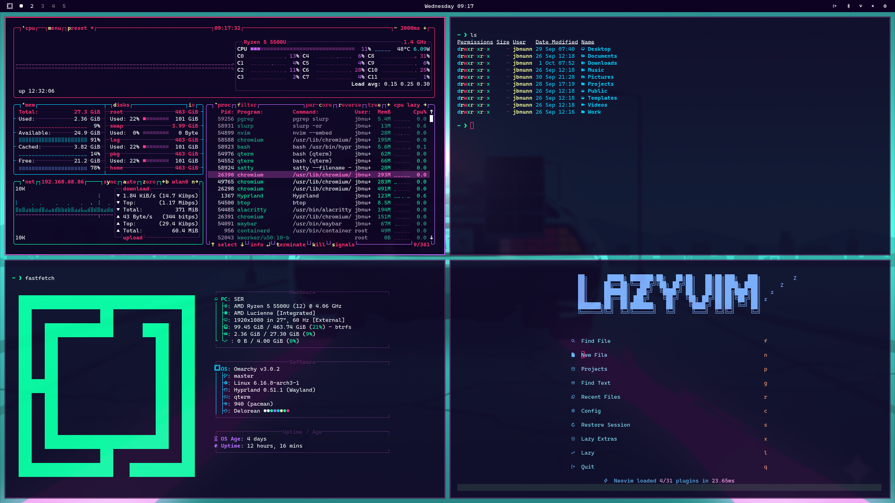

# DeLorean - Theme for Omarchy

Great Scott! This theme sends Omarchy hurtling through time with neon-soaked 1980s vibes where every terminal glow feels like cruising at 88 mph.



## Setting your Omarchy theme to DeLorean

1. Press `SUPER + ALT + SPACE`
2. Click `Style`
3. Click `Theme`
4. Select `DeLorean`

#### Install with GUI:

1. Copy `https://github.com/jbnunn/omarchy-delorean-theme`
2. Press `SUPER + ALT + SPACE`
3. Click `Install`
4. Click `Theme`
5. Paste the link 

#### Install with Bash:

```bash
omarchy-theme-install https://github.com/jbnunn/omarchy-delorean-theme.git
```
## Wallpapers

This theme includes a stash of plutonium-infused wallpapers to keep your desktop glowing hotter than a DeLorean reactor.


## License

This project is licensed under the [MIT](LICENSE) license.
